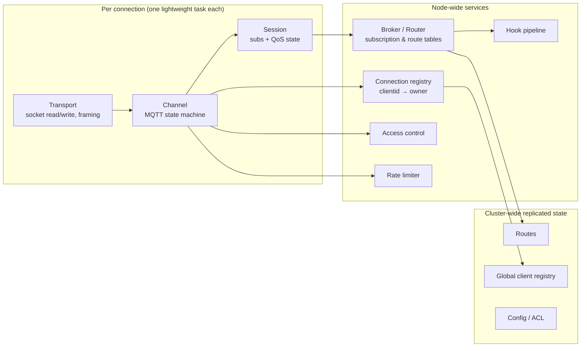
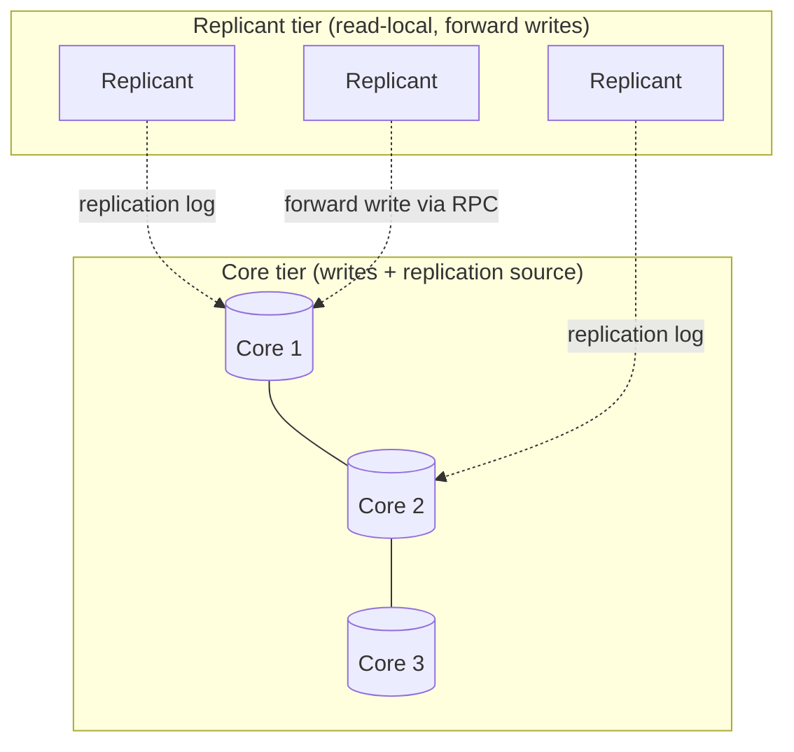

# 01 — Overview & Core Concepts

This document establishes the vocabulary, the layered architecture, the domain data model, and
— most importantly for a reimplementation — **the mapping from Erlang/OTP/BEAM mechanisms to
portable concepts** you will use in another technology.

## 1. What EMQX is

EMQX is an **MQTT broker / messaging platform**. Its core job is publish/subscribe message
routing for huge numbers of long-lived client connections, with the reliability guarantees the
MQTT specification requires. Around that core it layers data processing (rule engine), external
integration (bridges), clustering, durable storage, multi-protocol gateways, and operations
tooling.

### MQTT in 90 seconds (the parts that shape the architecture)

- **Connection-oriented.** A client opens a long-lived TCP/TLS/WebSocket/QUIC connection and
  sends a `CONNECT` packet with a **Client ID**, optional username/password, keepalive interval,
  a `clean_start` flag, and an optional **Will** message.
- **Publish/Subscribe.** Clients `SUBSCRIBE` to **topic filters** (e.g. `sensors/+/temp`,
  `building/#`) and `PUBLISH` to concrete **topics** (e.g. `sensors/a1/temp`). The broker routes
  each published message to all matching subscribers. Publishers and subscribers never know
  about each other.
- **Wildcards.** `+` matches exactly one topic level; `#` matches the remaining levels and must
  be last. Topics beginning with `$` (e.g. `$SYS/...`) are excluded from wildcard matches.
- **QoS (quality of service).** Per message/subscription:
  - **QoS 0** — at most once, fire-and-forget.
  - **QoS 1** — at least once: `PUBLISH` → `PUBACK`, retransmit until acked.
  - **QoS 2** — exactly once: `PUBLISH` → `PUBREC` → `PUBREL` → `PUBCOMP` four-way handshake.
- **Sessions.** When `clean_start=false` (MQTT 5: session expiry interval > 0), the broker keeps
  the client's subscriptions and undelivered QoS-1/2 messages while it is offline, and replays
  them on reconnect. This is **session state** and is central to broker design.
- **Retained messages.** A publish with the `retain` flag is stored as the "last known good"
  value for its topic and delivered immediately to any future subscriber of a matching filter.
- **Shared subscriptions.** A `$share/<group>/<filter>` subscription load-balances each message
  to exactly one member of the group (instead of all subscribers).
- **MQTT 5.0** adds properties, reason codes, topic aliases, flow control, enhanced auth (`AUTH`
  packet), and per-message/subscription expiry. The reimplementation should target MQTT 5.0 and
  treat 3.1.1 as a downgrade.

## 2. Layered architecture

Read top-to-bottom as the path of a single client and its messages; the right column is what a
reimplementation must provide.



**Layer responsibilities**

| Layer | Responsibility | Reimplementation note |
|-------|----------------|-----------------------|
| Transport | Accept sockets, read/write bytes, TLS, WebSocket upgrade, backpressure | Async I/O runtime; one task/coroutine per connection |
| Channel | MQTT codec + protocol state machine; enforce caps; drive auth/session | A per-connection state machine struct + event handlers |
| Session | Subscriptions, inflight window, pending-message queue, QoS handshakes, replay | In-memory structures; optional durable backend |
| Broker/Router | Maintain subscription & route tables; match topics; dispatch messages | Concurrent maps + a wildcard topic index (trie) |
| Connection registry | Track which local task owns a client ID; coordinate takeover | Concurrent map + cluster registry (P2) |
| Access control | Authenticate connect; authorize publish/subscribe | Chain of providers + ordered ACL sources + cache |
| Hook pipeline | Fire extension callbacks at lifecycle points | Ordered middleware with priorities; allow short-circuit |
| Rate limiter | Token-bucket quotas per zone/listener/client | Shared atomic counters / token buckets |
| Cluster state | Replicate routes, registry, config across nodes | Raft/replicated KV + an RPC mesh (Phase 3) |

## 3. Domain data model (the records you will port)

These are the real EMQX records. Reproduce their *fields*, not their Erlang representation.

### Message — `apps/emqx_utils/include/emqx_message.hrl`
```erlang
-record(message, {
  id,                 %% globally unique message id (see emqx_guid)
  qos = 0,            %% 0 | 1 | 2
  from,               %% originating clientid (or internal source atom)
  flags = #{},        %% #{dup => bool, retain => bool, sys => bool}
  headers = #{},      %% metadata: protocol ver, username, peerhost, MQTT 5 props, ...
  topic,              %% binary topic the message was published to
  payload,            %% the bytes
  timestamp,          %% milliseconds since epoch
  extra = #{}         %% misc (e.g. trace context, queue insertion times)
}).
```
This is the universal currency of the broker — produced at PUBLISH, carried through hooks, rules,
routing, and delivery. **Design your `Message` type to carry arbitrary `headers`/`flags`** so
features (auth attributes, properties, tracing) can attach metadata without changing the core
type.

### Subscription, route, delivery — `apps/emqx/include/emqx.hrl`
```erlang
-record(subscription, {topic, subid, subopts}).      %% subopts: qos, nl, rap, rh, share-group...
-record(route, {topic, dest}).                        %% dest :: node() | {Group, node()}
-record(deliver, {topic, message}).                   %% a routed message handed to a subscriber
-record(delivery, {sender :: pid(), message}).        %% an outgoing delivery with its sender
```

### Connection & client identity (maps, in `emqx_types`)
- **`conninfo`** — socket/peername/sockname, protocol name & version, `clean_start`, keepalive,
  `expiry_interval`, `connected_at`, will details. Everything about *this connection*.
- **`clientinfo`** — `clientid`, `username`, `zone`, `listener`, `peerhost`, `is_superuser`,
  `mountpoint`, `client_attrs`. Everything about *this authenticated identity*. `clientinfo` is
  threaded into auth, authz, and hook calls so policies can match on it.

### Channel state — `apps/emqx/src/emqx_channel.erl`
```erlang
-record(channel, {
  conninfo, clientinfo,        %% identity (above)
  session,                     %% the session implementation state (or none until CONNECT)
  keepalive, will_msg,
  topic_aliases, alias_maximum,%% MQTT 5 topic alias bookkeeping
  auth_cache,                  %% enhanced-auth scratch state
  quota,                       %% rate-limiter client handles
  timers,                      %% named timers (keepalive, retry, expire-awaiting-rel, ...)
  conn_state,                  %% idle | connecting | connected | reauthenticating | disconnected
  takeover, resuming, pendings %% session-takeover bookkeeping
}).
```
The `conn_state` enum is the protocol state machine; see [02](./02-broker-core.md).

## 4. Cluster topology: core vs replicant

EMQX clusters use a **core/replicant** model (from the Mria library):

- **Core nodes** hold the authoritative copies of replicated tables (routes, registry, config)
  and accept writes.
- **Replicant nodes** keep read-only local copies (kept current via a replication log) and
  forward writes to a core. They scale out the connection-handling tier without adding write
  contention.



A reimplementation can start **single-node** (no replication at all) and later adopt this split,
or a simpler "all nodes equal over a Raft/replicated KV" model. See
[06](./06-clustering-and-configuration.md).

## 5. ⭐ BEAM/OTP → portable-concept mapping (the central asset)

EMQX leans heavily on the Erlang runtime (BEAM). To reimplement it elsewhere you must recognise
each mechanism and substitute the equivalent concept. **This table is the most reusable part of
this whole document.**

| EMQX / BEAM mechanism | What it does in EMQX | Portable concept to use instead |
|-----------------------|----------------------|---------------------------------|
| **Lightweight process** (per connection, per worker) | One cheap, isolated, preemptively-scheduled actor per connection holding its own state; millions per node | Async task / green thread / coroutine (one per connection) **or** a sharded thread-pool with an explicit state machine per connection. Must be cheap at ~10⁵–10⁶ scale. |
| **Message passing** (`!`, `gen_server:call/cast`) | Async/sync communication between isolated processes; natural backpressure via mailboxes | Channels/queues (async) + request/response (sync). Bound the queues to get backpressure. |
| **`gen_server` / `gen_statem`** | Standardized stateful service / explicit state machine with callbacks | A service object/actor with an event loop, or an explicit FSM (enum state + transition handlers). |
| **Supervisor tree** | Declarative process hierarchy with restart strategies (`one_for_one`, `one_for_all`) | A supervision/lifecycle layer: structured concurrency, a process manager, or an orchestrator (systemd/k8s) for top-level; in-process supervisors for workers. |
| **ETS** (Erlang Term Storage) | In-memory, concurrent, lock-light key/value & bag tables for subscriptions, registry, caches | A concurrent hash map (sharded for write scaling). Bag semantics → multimap. Read-mostly → copy-on-write or RCU. |
| **Mnesia / Mria** | Distributed, replicated tables (routes, registry, ACL, config) with a core/replicant replication log | A replicated store: Raft-backed KV, or SQL + change-data-capture, or a CRDT/gossip layer for eventually-consistent tables. |
| **Distributed Erlang + `gen_rpc`** | Transparent inter-node messaging and RPC mesh | A service mesh: gRPC/HTTP2 between nodes + service discovery (DNS, Consul, etcd, k8s). |
| **`persistent_term`** | Ultra-fast read-mostly global constants (limiter settings, hook tables) | A read-mostly global cache (atomic pointer swap / `arc-swap`-style) refreshed on config change. |
| **Process dictionary** | Per-process scratch state (e.g. authz cache) | Task-local / connection-local storage on your per-connection struct. |
| **HOCON + schema (`hoconsc`, `typerefl`)** | Typed, hierarchical config with validation, defaults, hot-reload | YAML/TOML + a schema/validation library; a typed config struct with defaults and validators. |
| **Hot code loading** | Upgrade modules without dropping connections | Drop it. Use rolling deploys (drain connections, restart) — see roadmap. Removing this removes a *large* amount of complexity. |
| **OTP releases / `relx`** | Self-contained runtime bundle | Your language's standard packaging (container image, static binary). |
| **`gproc` pools** | Hash-partitioned worker pools for the broker | A fixed array of shards/workers; pick by `hash(topic) % N`. |
| **`esockd` / `cowboy` / `quicer`** | TCP/TLS acceptor pools, WebSocket server, QUIC | Your runtime's socket library, a WebSocket lib, optional QUIC lib (QUIC is droppable for MVP). |
| **`gb_trees`** (inflight window) | Ordered map keyed by packet id | A sorted/ordered map (e.g. BTreeMap / TreeMap). |

### Three principles that fall out of this table

1. **Per-connection isolation is the whole model.** EMQX gives each connection its own process
   with its own heap and mailbox. Your reimplementation needs an equally cheap unit of
   concurrency, or it will not reach MQTT-scale connection counts. This single decision shapes
   everything.
2. **Shared state lives in concurrent tables, not in a connection's process.** Subscriptions,
   routes, and the client registry are read by many connections and must be lock-light. ETS →
   sharded concurrent maps is the key substitution.
3. **"Cluster" is just replication + RPC.** Everything cluster-related is either a replicated
   table (routes, registry, config) or a remote call (forward a publish, run a takeover). If you
   build single-node first and keep those two seams clean, clustering is an additive phase.

## 6. Where to go next

- The hot path in detail: [02 — Broker Core](./02-broker-core.md).
- Session/QoS mechanics: [03 — Sessions & Clients](./03-sessions-and-clients.md).
- The minimal build and phasing: [10 — Reimplementation Roadmap](./10-reimplementation-roadmap.md).
