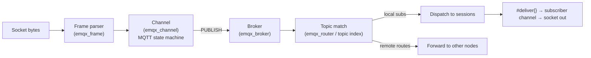
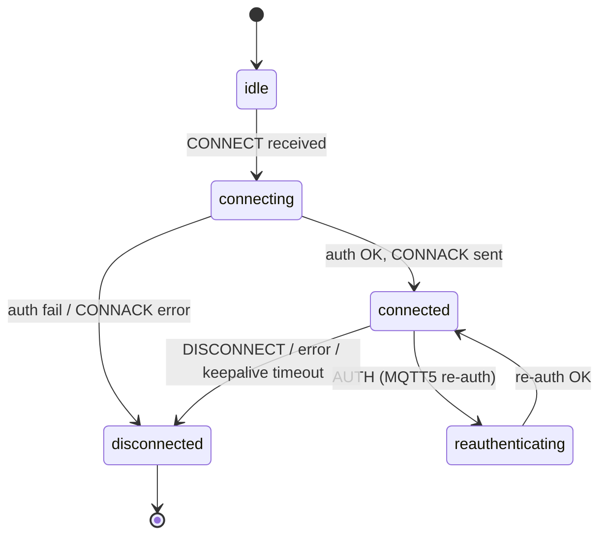
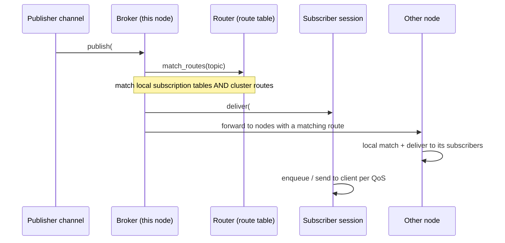

# 02 — Broker Core (Transport, Protocol, Pub/Sub Routing)

This is the **hot path**: how bytes on a socket become an MQTT message that reaches every
matching subscriber. It is the part you must build first and get right. Everything here is
**MVP** unless marked otherwise.



## 1. Transport / Listeners

**Responsibility.** Accept connections on each configured endpoint, manage acceptor pools and
connection limits, terminate TLS, upgrade WebSocket, and hand a framed byte stream to a
per-connection channel.

**Key source.**
- `apps/emqx/src/emqx_listeners.erl` — listener lifecycle. Listener types:
  `tcp | ssl | ws | wss | quic | dtls`. TCP/TLS run on the `esockd` acceptor library;
  WS/WSS run on `cowboy` (HTTP server upgraded to WebSocket); QUIC on `quicer`.
- `apps/emqx/src/emqx_connection.erl` — the per-connection process for TCP/TLS. Owns a receive
  loop, the socket, the frame parser state, the serializer options, and the `emqx_channel`
  state. Implements its own loop (with `sys`/system-message support) rather than a plain
  `gen_server`.
- `apps/emqx/src/emqx_ws_connection.erl` — WebSocket connection (Cowboy callbacks
  `websocket_handle/info/close`).
- `apps/emqx/src/emqx_quic_connection.erl`, `emqx_quic_stream.erl`, `emqx_quic_data_stream.erl`
  — QUIC connection owner + per-stream MQTT.
- `apps/emqx/src/emqx_socket_connection.erl` — newer socket-based variant of the TCP path.
- `apps/emqx/src/emqx_frame.erl` — **MQTT codec.** Stateful parser that accumulates bytes until a
  full packet is available (MQTT uses a variable-length "remaining length" field). Honors
  `max_size`, `strict_mode`, and the negotiated protocol version. `apps/emqx/src/emqx_packet.erl`
  validates packets and converts between packets and `#message{}`.

**Process model.** One process per connection. The connection process reads with bounded
`{active, N}` flow control and applies **backpressure** by pausing reads when downstream is slow
(`apps/emqx/src/emqx_congestion.erl`), and can **hibernate** when idle to shrink memory.

**Portable notes.**
- One async task per connection. The task owns its socket, a streaming **frame decoder** (a state
  machine that yields complete packets from a byte buffer), and the channel state.
- Reproduce the **variable-length decoder** carefully — it is the one piece of binary protocol
  that bites every reimplementation. Enforce a max packet size to avoid memory abuse.
- Backpressure: stop reading from the socket when the client's outbound queue or downstream is
  full. Bounded queues give you this naturally.
- TLS and WebSocket are standard library concerns. **QUIC and DTLS are droppable for MVP.**

## 2. Channel — the MQTT protocol state machine

**Responsibility.** Implement the MQTT protocol per connection: handle each inbound packet, drive
authentication and session open/resume, enforce capabilities/limits, and produce outbound
packets. This is the brain of a connection.

**Key source.** `apps/emqx/src/emqx_channel.erl`. State is the `#channel{}` record (see
[01 §3](./01-overview-and-concepts.md)); the `conn_state` field is the state machine:



**Inbound handlers** (one per MQTT packet type, dispatched by `handle_in/2`):

| Packet | What the channel does |
|--------|------------------------|
| `CONNECT` | Validate protocol/flags; **authenticate** (see [04](./04-access-control.md)); open or resume **session**; register in the connection manager; send `CONNACK`. |
| `PUBLISH` | Enforce caps & topic-alias; **authorize publish**; build `#message{}`; run `message.publish` hook; route via broker; perform QoS-1/2 ack handshake. |
| `SUBSCRIBE` | Validate filters; **authorize subscribe** per filter; add subscriptions to the session/broker; send `SUBACK` (with per-filter reason codes); deliver matching retained messages. |
| `UNSUBSCRIBE` | Remove subscriptions; send `UNSUBACK`. |
| `PUBACK/PUBREC/PUBREL/PUBCOMP` | Advance the QoS-1/2 state machine in the session. |
| `PINGREQ` | Reset keepalive; reply `PINGRESP`. |
| `DISCONNECT` | MQTT5: read reason/expiry; clear or keep will; tear down. |
| `AUTH` | MQTT5 enhanced authentication / re-authentication. |

**Supporting mechanisms.**
- **Keepalive** — `apps/emqx/src/emqx_keepalive.erl`. Tracks inbound activity; if the client is
  silent for ~1.5× the negotiated interval, the connection is closed.
- **Flapping detection** — `apps/emqx/src/emqx_flapping.erl`. A node-wide table counts rapid
  connect/disconnect cycles per client id and can temporarily ban offenders (works with
  `apps/emqx/src/emqx_banned.erl`).
- **Topic aliases** (MQTT5) — map small integers to topics to save bytes; tracked per channel.
- **Capabilities** — `apps/emqx/src/emqx_mqtt_caps.erl` enforces max QoS, max topic levels,
  retain availability, wildcard availability, etc.

**Portable notes.** Model the channel as an explicit FSM: a `ConnState` enum plus a
`handle_packet(packet)` dispatch. Keep all per-connection state (session handle, keepalive
deadline, alias maps, timers) in one struct owned by the connection task. Timers can be a single
"next deadline" check per loop iteration rather than many OS timers.

## 3. Rate limiting (cross-cutting, **MVP-lite**)

**Key source.** `apps/emqx/src/emqx_limiter/` (see its `README.md`). A **token-bucket** model:
a *limiter* is `{Group, Name}` (e.g. `{{zone, default}, messages}`) with a `rate` and optional
`burst`. **Shared** limiters back the bucket with atomic counters so many connections consume
cooperatively; **exclusive** limiters give each client its own bucket. Settings are cached in
`persistent_term`.

**Portable notes.** Implement token buckets backed by atomic integers for shared limits
(messages/sec, bytes/sec per zone/listener) and per-connection buckets for per-client limits. A
minimal build can start with per-connection rate limits only.

## 4. Pub/Sub — Broker and Router

This is where a published message fans out to subscribers, locally and across the cluster.

### 4.1 Two tables: subscriptions (local) vs routes (cluster)

- **Subscription tables (local, in-memory).** Who, *on this node*, is subscribed to what. Held in
  concurrent (ETS) tables by `apps/emqx/src/emqx_broker.erl`:
  - `emqx_subscriber` — `Topic → SubscriberPid` (bag; supports sharding hot topics).
  - `emqx_subscription` — `SubscriberPid → Topic` (reverse index for cleanup).
  - `emqx_suboption` — `{Topic, SubPid} → SubOpts` (qos, no-local, retain-handling, share group).
- **Route table (cluster, replicated).** Which *nodes* have at least one subscriber for a topic
  (or wildcard filter). Held in Mria tables by `apps/emqx/src/emqx_router.erl`
  (`#route{topic, dest}` where `dest` is a node, or `{Group, node}` for shared subs). Storage
  schema is versioned (`v3` current). Wildcard filters additionally populate a topic index for
  matching.

The split matters: a subscribe on node A inserts a **local** subscription *and*, the first time
any node subscribes to that topic/filter, adds a **route** advertising "node A wants this topic".
Other nodes consult routes to decide which remote nodes to forward a publish to.

### 4.2 Publish data flow



**Key source.**
- `apps/emqx/src/emqx_broker.erl` — `publish/1`, `subscribe/3,4`, `unsubscribe/1`, `dispatch/2`.
  The broker is a **hash-partitioned pool** of workers (via `gproc` pools managed under
  `emqx_broker_sup.erl` / `emqx_broker_helper.erl`); a topic hashes to a worker so subscription
  bookkeeping for a topic is serialized on one worker while remaining lock-light overall.
- `apps/emqx/src/emqx_router.erl` + `apps/emqx/src/emqx_router_syncer.erl` — route reads and
  **batched** asynchronous route updates to keep the replicated table from thrashing under churn.

**Portable notes.**
- Two structures: a **local subscription multimap** (`topic → set of subscriber handles`) and, for
  clustering, a **replicated route set** (`topic/filter → set of node ids`). For single-node MVP
  you only need the local one.
- Shard the subscription map by `hash(topic)` to scale writes; deliver to subscribers via bounded
  queues (the equivalent of `gen_server:cast` to each session).
- Delivery is **fire-and-forget at the routing layer**; per-subscriber QoS/retransmission is the
  session's job ([03](./03-sessions-and-clients.md)).

## 5. Topic matching (wildcards)

**Responsibility.** Given a concrete publish topic, find all subscribed **filters** that match —
efficiently, with potentially millions of subscriptions.

**Key source.**
- `apps/emqx/src/emqx_topic.erl` — tokenization, validation, and direct `match(Topic, Filter)`.
- `apps/emqx/src/emqx_trie_search.erl` — the core wildcard search algorithm.
- `apps/emqx/src/emqx_topic_index.erl` — an ETS-backed index wrapping the trie search (used for
  the cluster route table's wildcard filters).
- `apps/emqx/src/emqx_topic_gbt.erl` / `emqx_topic_gbt_pterm.erl` — a `gb_trees`-backed index
  variant (used where an in-process structure is preferable, e.g. persistent sessions).

**Algorithm.** Topics are split into level words (`a/b/c → [a,b,c]`). Matching walks the words:
exact word, `+` (any one word), `#` (rest). The index stores filters so that, given a concrete
topic, only the relevant branches are visited instead of testing every filter. `$`-prefixed
topics are excluded from `+`/`#` at the first level.

**Portable notes.** Build a **topic trie** keyed by level words with explicit `+` and `#` edges;
a lookup descends the trie collecting matches. This is a well-understood data structure and a
good first thing to unit-test against the MQTT spec examples. Keep exact-match (`topic → subs`) in
a plain map and only consult the trie for wildcard filters — most subscriptions are exact, so this
keeps the common path O(1).

## 6. Shared subscriptions

**Responsibility.** For `$share/<group>/<filter>`, deliver each message to **one** group member
(load balancing) instead of all members.

**Key source.** `apps/emqx/src/emqx_shared_sub.erl` (+ `apps/emqx/src/emqx_ds_shared_sub/` for
the durable variant). Group membership is tracked in a replicated table. **Dispatch strategies:**
`random`, `round_robin`, `round_robin_per_group`, `sticky`, `local` (prefer same-node members),
`hash_clientid`, `hash_topic`.

**Portable notes.** Maintain `group → [members]` and pick one member per message by the chosen
strategy. Optionally support ack-aware redelivery (re-dispatch if the chosen member doesn't ack).
**P2** — not needed for an MVP broker.

## 7. Retained messages, Will messages, Mountpoint

- **Retained** — `apps/emqx_retainer/`. On `PUBLISH` with `retain=true`, store (or, with empty
  payload, clear) the message keyed by topic in a backend (Mnesia or `emqx_ds`). On `SUBSCRIBE`,
  query the store for filters matching the new subscription and deliver immediately. **MVP**
  (with an in-memory store; durability is optional).
- **Will** — held in `#channel.will_msg`. Published if the connection drops abnormally (cleared on
  clean `DISCONNECT`); MQTT5 supports a *will delay interval* before publishing. **MVP.**
- **Mountpoint** — `apps/emqx/src/emqx_mountpoint.erl`. A per-listener/zone prefix (with
  `${clientid}` / `${username}` templating) prepended to a client's topics for namespace
  isolation / multi-tenancy. Applied on ingress and stripped on egress. **Opt.**

## 8. Hooks — the in-process extension pipeline

**Responsibility.** Let other subsystems (auth, rule engine, retainer, metrics, plugins) observe
or modify the message/client lifecycle without the core knowing about them.

**Key source.** `apps/emqx/src/emqx_hooks.erl` (registry; callbacks run in **priority** order and
may return `stop`/`{stop, NewAcc}` to short-circuit and transform) and
`apps/emqx/src/emqx_hookpoints.erl` (the catalog). The actual hook points include:

```
client.connect      client.connack       client.connected     client.disconnected
client.authenticate client.authorize      client.subscribe     client.unsubscribe
client.check_authn_complete client.check_authz_complete
session.created     session.subscribed    session.unsubscribed  session.terminated
session.resumed     session.discarded     session.takenover
message.publish     message.delivered     message.acked         message.dropped
message.puback      message.nack          delivery.dropped      delivery.completed
alarm.activated     alarm.deactivated
```

`message.publish` is the most important: it is where the **rule engine**, **message
transformation**, and **schema validation** plug in, each at a defined priority.

**Portable notes.** Implement an ordered **middleware pipeline** per hook point: a list of
`(priority, callback)` where a callback can pass through, mutate the accumulator (e.g. the
message), or stop the chain. Keep the catalog of hook points small and explicit. This is the
single most important extension seam — auth, rules, metrics, and plugins all ride on it.

---

**Next:** how the session keeps QoS state and survives reconnects →
[03 — Sessions & Clients](./03-sessions-and-clients.md).
