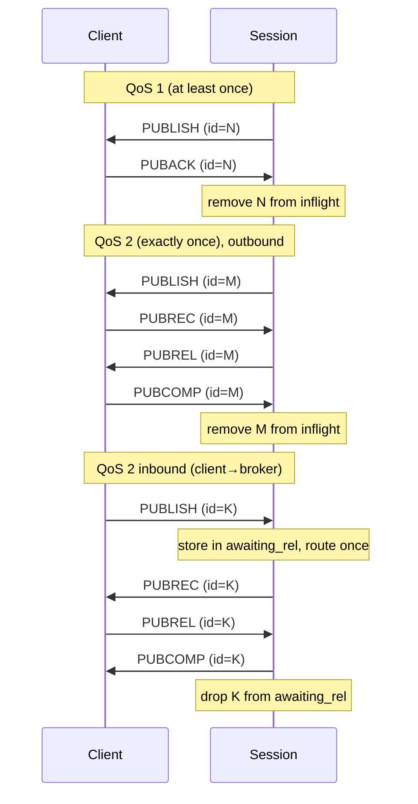
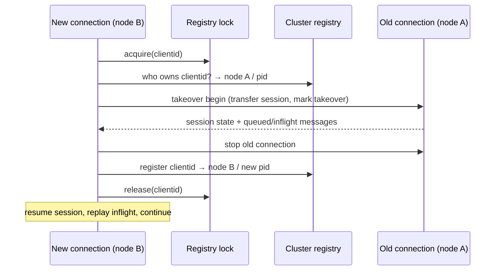

# 03 — Sessions & Client Lifecycle

The **session** is what makes an MQTT broker more than a fan-out switch: it remembers a client's
subscriptions and in-flight QoS-1/2 messages, retransmits, and replays undelivered messages after
a reconnect. The **connection manager** tracks which process owns a client id and coordinates
*takeover* when the same client reconnects. Sessions are **MVP** (in-memory); the durable variant
is **Phase 3**.

## 1. Session: responsibility and the two implementations

**Responsibility.** Per client, the session owns:
- the set of **subscriptions** (topic filter → options),
- the **inflight window** — QoS-1/2 messages sent to the client but not yet fully acknowledged,
- the **pending queue** — messages waiting because the client is offline or the inflight window
  is full,
- the QoS-2 **awaiting-rel** set (received PUBLISH awaiting PUBREL),
- packet-id allocation, and message **replay** on resume.

**Key source.** `apps/emqx/src/emqx_session.erl` defines a **behaviour** (a callback interface)
with two implementations:

| Implementation | Source | State lives in | Survives node restart? |
|----------------|--------|----------------|------------------------|
| **In-memory** | `apps/emqx/src/emqx_session_mem.erl` | the connection process heap | No |
| **Durable (DS)** | `apps/emqx/src/emqx_persistent_session_ds.erl` (+ `emqx_persistent_session_ds/`) | `emqx_ds` durable storage ([07](./07-durable-storage.md)) | Yes |

The behaviour's callbacks are the **session contract** you must reproduce (from
`emqx_session.erl`):

```
create/4  open/4  destroy/1
subscribe/3  unsubscribe/2  get_subscription/2
publish/3                         %% client→broker PUBLISH (incl. QoS2 receive side)
puback/3  pubrec/2  pubrel/2  pubcomp/3   %% QoS ack handshakes
deliver/3                         %% broker→client: enqueue messages for this subscriber
replay/3                          %% resend inflight after resume
handle_timeout/3  handle_info/3   %% timers (retry, expiry) and async events
disconnect/2  terminate/3         %% lifecycle
info/2  stats/1                   %% introspection
clear_will_message/1  publish_will_message_now/2
```

**Portable notes.** Define a `Session` interface with exactly these operations. Provide a
straightforward in-memory implementation first; make the durable one a drop-in alternative behind
the same interface. Note that in EMQX the session is **not its own process** — it is a state value
manipulated by the connection process. You can do the same: the session is a struct the
connection task mutates, not a separate task.

### In-memory session state — `emqx_session_mem.erl`
```erlang
#session{
  id, created_at,
  subscriptions,    %% #{TopicFilter => SubOpts}
  inflight,         %% emqx_inflight: PacketId => {phase, message, sent_ts}
  awaiting_rel,     %% #{PacketId => message}  (QoS2 receive side)
  mqueue,           %% emqx_mqueue: pending messages (FIFO + priorities)
  next_pkt_id       %% 1..65535 wrap-around
}
```

## 2. Inflight window and pending queue

- **Inflight** — `apps/emqx/src/emqx_inflight.erl`. An **ordered map keyed by packet id**
  (`gb_trees`) of messages sent but not fully acked, each with a delivery phase and timestamp. A
  bounded size (`Receive-Maximum`) caps how many unacked messages may be outstanding; ordering by
  id/time drives **retransmission** of the oldest unacked entries on timeout.
- **Pending queue** — `apps/emqx/src/emqx_mqueue.erl` (+ `apps/emqx/src/emqx_pqueue.erl` for
  priorities). Holds messages that cannot be sent yet (client offline, or inflight full). Has a
  max length and a drop policy (drop oldest, optionally never queue QoS-0), and counts drops.

**Portable notes.** Inflight = a sorted map (BTreeMap/TreeMap) `packet_id → InflightEntry{phase,
message, sent_at}`. Pending = a bounded FIFO (with optional priority) and an explicit overflow
policy. The interplay is: deliver → if room in inflight, send + add to inflight; else enqueue.
On ack, remove from inflight and pull the next pending message.

## 3. QoS handshakes (the correctness core)



The session tracks a **phase per inflight entry** (`wait_ack` for QoS1; `wait_rec` → `wait_comp`
for QoS2 outbound) and an **awaiting-rel** set for QoS2 inbound (so a duplicate inbound PUBLISH is
not routed twice). Retransmission fires on a timer for entries that sit too long.

**Portable notes.** This is the part to test exhaustively: duplicate packets, out-of-order acks,
packet-id wrap-around, retransmit-on-reconnect, and the QoS2 "route exactly once even if the
PUBLISH is re-sent" rule. Reuse EMQX's behaviour as the spec for edge cases.

## 4. Connection manager and client registry

**Responsibility.** Track, on each node, which process currently owns a given client id; look up a
client anywhere in the cluster; and coordinate **takeover** when a client id reconnects (MQTT
allows only one active connection per client id).

**Key source.**
- `apps/emqx/src/emqx_cm.erl` — node-local channel manager (a `gen_server` plus ETS tables
  `emqx_channel*`: `clientid → pid`, `pid → {module, clientid}`, cached info/stats). It monitors
  connection processes and cleans up their entries on exit.
- `apps/emqx/src/emqx_cm_registry.erl` (+ `emqx_cm_registry_keeper.erl`) — the **cluster-wide**
  registry (a Mria/replicated table) so any node can find which node/pid owns a client id.
- `apps/emqx/src/emqx_cm_locker.erl` — a distributed lock to make takeover atomic across nodes.

**Takeover sequence** (same client id reconnects, possibly on another node):


**Portable notes.**
- Node-local: a concurrent map `clientid → connection handle`, with cleanup when a connection
  task ends (a "monitor" equivalent — e.g. a drop guard or a finalizer that removes the entry).
- Cluster (Phase 3): a replicated registry `clientid → node` and an RPC to perform the handoff,
  guarded by a **distributed lock or lease** (Raft/etcd lease, Redis lock) so two reconnects can't
  both win.
- For a single-node MVP, takeover is purely local: find the existing owner, transfer its session
  (subscriptions + inflight + queue), stop it, install the new one.

## 5. Session expiry and clean start

- `clean_start=true` (MQTT5 `Session-Expiry-Interval=0`): no session is kept after disconnect — a
  fresh session each connect.
- `clean_start=false` with an expiry interval: on disconnect the session is retained (queuing
  messages for offline delivery) until the expiry timer fires, then destroyed.

**Portable notes.** Keep disconnected-but-not-expired sessions in a node-local table keyed by
client id with an expiry deadline; a sweeper (or per-session timer) destroys them on timeout. With
durable sessions this table is backed by storage so it survives restarts.

---

**Next:** gating connect/publish/subscribe → [04 — Access Control](./04-access-control.md).
