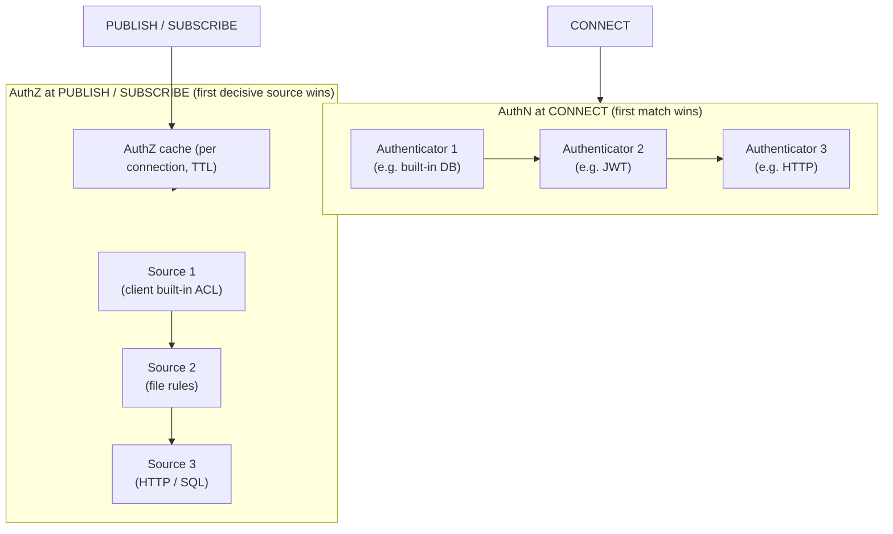

# 04 — Access Control (Authentication & Authorization)

Access control answers two questions: **AuthN** — "is this client who it claims to be?" (at
`CONNECT`), and **AuthZ** — "is this client allowed to publish/subscribe to this topic?" (at every
`PUBLISH`/`SUBSCRIBE`). Both are designed as **ordered, pluggable chains** with a result cache.
Basic auth is **MVP**; external backends are **Phase 2**.



## 1. Entry point

**Key source.** `apps/emqx/src/emqx_access_control.erl` — the façade the channel calls:
- `authenticate(ClientInfo)` → runs the AuthN chain, returns enriched result or rejects.
- `authorize(ClientInfo, Action, Topic)` → checks the AuthZ cache, then the AuthZ sources.

These are also exposed as the `client.authenticate` and `client.authorize` hook points so the
`emqx_auth` app can install the actual logic.

## 2. Authentication (AuthN)

**Responsibility.** At `CONNECT`, run an **ordered chain** of authenticators until one
authenticates the client (`{ok, ...}`), one explicitly rejects (`{error, ...}`), or the chain is
exhausted (deny). Chains can be global or per-listener/protocol.

**Key source.** `apps/emqx_auth/src/emqx_authn/emqx_authn_chains.erl` manages the chains (a
`gen_server` + ETS). Each backend implements the **provider behaviour**
(`emqx_authn_provider`):

```
create(AuthenticatorId, Config) -> {ok, State} | {error, _}
update(Config, State)           -> {ok, State} | {error, _}
authenticate(Credential, State) ->
      ignore                        %% not my client, try next
    | {ok, Extra}                   %% success; Extra may set is_superuser, client_attrs, expire_at, acl
    | {ok, Extra, AuthData}         %% success with returned auth data (MQTT5 enhanced auth)
    | {continue, Cache | AuthData}  %% multi-step (e.g. SCRAM / enhanced auth)
    | {error, Reason}               %% explicit reject
destroy(State) -> ok
%% optional user-management callbacks: add/delete/update/lookup/list/import users
```

**The authentication result** enriches `clientinfo`: `is_superuser` (bypass authz),
`client_attrs` (key/values usable later in authz conditions and templates), `expire_at` (force
re-auth/disconnect), and an optional inline **`acl`** (rules attached to this client — feeds the
"client built-in ACL" authz source).

**Backends** (each an `emqx_authn_provider`, under `apps/emqx_auth_*`):

| Backend | App | Mechanism |
|---------|-----|-----------|
| Built-in DB | `emqx_auth_mnesia` | Users + salted password hashes in a replicated table; superuser flag; import/export. **MVP-friendly.** |
| Password-based via SQL | `emqx_auth_mysql`, `emqx_auth_postgresql` | Templated query returns hash/salt/superuser. |
| Password-based via Redis | `emqx_auth_redis` | `HGET`/`GET` on a key template. |
| HTTP | `emqx_auth_http` | POST/GET to an external service; 200 = allow. |
| JWT | `emqx_auth_jwt` | Verify signature (incl. JWKS endpoint), validate claims, map claims → attrs/acl. |
| LDAP | `emqx_auth_ldap` | LDAP bind. |
| MongoDB | `emqx_auth_mongodb` | Collection query. |
| Kerberos / GSSAPI | `emqx_auth_kerberos` | Enhanced-auth (multi-step) example. |
| Client-info | `emqx_auth_cinfo` | Decisions from connection attributes (TLS cert fields, etc.). |

Password hashing (bcrypt, pbkdf2, sha256+salt, …) lives in `apps/emqx/src/emqx_passwd.erl`.

**Portable notes.** Model AuthN as `Vec<Authenticator>` where each implements
`authenticate(credential) -> Ignore | Ok(attrs) | Continue(state) | Deny`. The chain stops on the
first non-`Ignore`. Build the in-memory/DB authenticator and one HTTP authenticator first; the
rest are config-driven variants of "query a store, compare a hash" or "call a service". Support
`Continue` from day one if you want SCRAM/enhanced auth, otherwise add it later.

## 3. Authorization (AuthZ)

**Responsibility.** For each publish/subscribe, consult **ordered sources** until one returns a
decisive `allow`/`deny`; if none match, fall back to the configured default (`deny` recommended).
Superusers short-circuit to allow.

**Key source.** `apps/emqx_auth/src/emqx_authz/` — `emqx_authz` installs the `client.authorize`
hook and holds the ordered source states. Each source implements `emqx_authz_source`:

```
create(Source)                                  -> SourceState
update(SourceState, Source)                      -> SourceState
authorize(ClientInfo, Action, Topic, SourceState) ->
      {matched, allow | deny | ignore}   %% decisive (ignore = skip but counted)
    | nomatch                            %% try next source
destroy(SourceState) -> ok
```

**ACL rule shape** — `apps/emqx_auth/src/emqx_authz/emqx_authz_rule.erl` compiles rules into:
```
{Permission, Condition, Action, Topic}
  Permission : allow | deny
  Condition  : ipaddr | username | clientid | client_attr | zone | listener
               | and/or/all combinations
  Action     : subscribe | publish | all   (with optional qos / retain constraints)
  Topic      : exact topic, or a filter with wildcards and ${clientid}/${username} placeholders
```

**Sources** (ordered; under `emqx_auth` and `apps/emqx_auth_*`):
- **Client built-in ACL** — the `acl` returned by AuthN, attached to the client.
- **File** — static rules from config.
- **Built-in DB** (`emqx_auth_mnesia`) — per-username/clientid rules in a replicated table.
- **HTTP / SQL / Redis / MongoDB / LDAP** — query an external store per check.

**Portable notes.** Model AuthZ as `Vec<AuthzSource>` returning `Matched(allow|deny) | NoMatch`,
evaluated in order, with a configurable default. Reproduce the **rule matcher**: a `(permission,
condition, action, topic-pattern)` tuple tested against `(clientinfo, action, topic)`, with
placeholder expansion (`${clientid}`, `${username}`) and wildcard topic matching reused from the
topic index ([02 §5](./02-broker-core.md)). A file/DB source plus one HTTP source covers most
needs.

## 4. Authorization cache (essential for throughput)

**Key source.** `apps/emqx/src/emqx_authz_cache.erl`. Because authorization runs on **every
publish**, results are cached **per connection**: key `{Topic, QoS, Retain}` (publish actions;
subscribe is not cached) → `allow|deny` with a timestamp. TTL expiry, a max size with LRU
eviction, and a global "drain" timestamp (bump it to invalidate all caches after a policy change).
A source may mark a decision non-cacheable.

**Portable notes.** Keep a small per-connection LRU with TTL for publish decisions. Provide a
global invalidation signal (a version counter compared on read) so config changes take effect
without walking every connection. This cache is the difference between authorizing once and
authorizing on every message at line rate.

## 5. Banning and flapping (cross-cutting)

`apps/emqx/src/emqx_banned.erl` maintains a (replicated) ban list by client id / username / IP /
CIDR, checked at connect and publish; `emqx_flapping.erl` ([02 §2](./02-broker-core.md)) feeds it
by banning clients that reconnect abusively. **Opt**, but cheap and worth adding early.

---

**Next:** processing and forwarding messages → [05 — Rule Engine & Data Integration](./05-rule-engine-and-integration.md).
