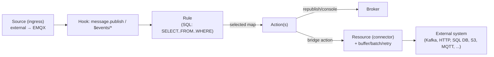

# 05 — Rule Engine & Data Integration

This layer turns EMQX from a message router into a data pipeline: an **SQL rule engine** selects
and transforms in-flight messages and events, and a generic **resource → connector → action/source**
stack forwards them to (or pulls them from) external systems. The whole layer is **Phase 2** — an
MVP broker does not need it — but it is the highest-value addition after the core.



## 1. Rule engine

**Responsibility.** Subscribe to message publishes and lifecycle **events**; for each, run a
rule's SQL: filter (`WHERE`), project/transform (`SELECT`), optionally iterate (`FOREACH`), then
hand the resulting map to one or more **actions**.

**Key source.** `apps/emqx_rule_engine/`.

A **rule** (stored in an ETS/replicated table) is roughly:
```
#{ id, name, sql,
   from,        %% topics/event-topics the rule listens to (parsed from FROM)
   fields,      %% SELECT projection
   conditions,  %% compiled WHERE
   is_foreach, doeach, incase,  %% FOREACH support
   actions,     %% built-in actions and/or bridge references
   enable }
```

**Pipeline:**
1. **Parse** — `emqx_rule_sqlparser.erl` turns the SQL string into an AST (`{select, …}` or
   `{foreach, …}`) using a Leex/Yecc grammar (`rulesql`). Fields can be constants, variable paths
   (`payload.sensor.temp`), aliases (`x as y`), or function calls.
2. **Trigger** — `emqx_rule_events.erl` registers hooks; each firing supplies a **Columns** map
   (message/event fields: `clientid, username, topic, payload, qos, retain, timestamp, …`). The
   `FROM` clause selects which topics/events feed a rule. Event topics include:
   `$events/client/{connected,disconnected}`, `$events/session/{subscribed,unsubscribed}`,
   `$events/message/{delivered,acked,dropped}`, `$events/sys/alarm_*`, etc., plus normal MQTT
   topics for `message.publish`.
3. **Evaluate** — `emqx_rule_runtime.erl`: evaluate `WHERE` (operators `= <> > < >= <= =~`,
   `and/or`, regex), then build the selected output map from `SELECT`; `FOREACH/DO/INCASE`
   produces multiple outputs from an array field.
4. **Act** — for each action, call it with the selected map and accumulate per-rule metrics
   (`matched`, `passed`, `failed`, `actions.{total,success,failed,…}`).

**Built-in functions** — `emqx_rule_funcs.erl`: string, math, type, JSON (`json_decode/encode`),
date/time, array/map, codec (base64/hex), hashing, etc. External functions can be registered.

**Built-in actions** — `emqx_rule_actions.erl`: `republish` (publish a templated message to
another topic) and `console` (log). All other actions are **bridge actions** (below).

**Portable notes.** The big effort is the **SQL dialect**: a parser (any parser-generator) plus a
tree-walking evaluator over a dynamically-typed `Columns` map. Start with a useful subset —
`SELECT <fields> FROM <topic-filter> WHERE <predicate>` with `republish` and a webhook action —
and grow functions on demand. Feed it from your `message.publish` hook and a handful of event
hooks. `FOREACH`, the full function library, and many event sources can come later.

## 2. Resource layer — the generic connector abstraction

**Responsibility.** A uniform lifecycle and runtime for **any** stateful external connection
(database, HTTP endpoint, message queue): start/stop, **health checks**, **connection pooling**,
synchronous and asynchronous queries, **batching**, **buffering with retry**, and per-resource
metrics. Every bridge is built on this.

**Key source.** `apps/emqx_resource/`. Backends implement the `emqx_resource` **behaviour**
(verified in `src/emqx_resource.erl`):

```
on_start(ResId, Config)               -> {ok, State} | {error, _}
on_stop(ResId, State)                 -> ok
callback_mode()                       -> sync | async_if_possible | always_sync ...
on_query(ResId, Request, State)       -> query_result()
on_batch_query(ResId, [Request], State) -> ...        %% optional, for batching
on_query_async(ResId, Request, ReplyCtx, State) -> ... %% optional
on_batch_query_async(...)             -> ...            %% optional
on_get_status(ResId, State)           -> connected | connecting | {disconnected, Reason}
%% multiplexing many actions/sources over one connection:
on_add_channel(ResId, State, ChannelId, ChannelConfig) -> {ok, State}
on_remove_channel(ResId, State, ChannelId)             -> {ok, State}
on_get_channels(ResId)                                 -> [ChannelConfig]
query_mode(Config) / query_opts(Config) / resource_type()
```

**Runtime pieces:**
- `emqx_resource_manager.erl` — a `gen_server` per resource that drives the lifecycle, runs
  periodic health checks (`on_get_status`), tracks status (`connected/connecting/disconnected`),
  and manages **channels** (multiple actions/sources sharing one connection).
- `emqx_resource_buffer_worker.erl` — a `gen_statem` (states `running`/`blocked`) providing an
  **async buffer**: a persistent (disk-backed) queue, **batching** by size/time, **retry** with
  TTL/expiry, dispatch strategies, and inflight tracking. This is what gives bridges
  backpressure, durability across restarts, and at-least-once delivery to external systems.
- Connection pooling uses `ecpool` (a pool of worker processes per resource).

**Portable notes.** This is a clean, reusable interface — define a `Connector` trait/interface
with exactly the callbacks above and a **buffer worker** that owns: a bounded (optionally
disk-spilling) queue, a batcher, a retry policy with per-request TTL, and an inflight table for
async replies. Health-check each connector on a timer and expose its status. Get this abstraction
right once and every integration becomes "implement the trait."

## 3. Connectors, Actions, Sources (Bridge v2 model)

**Responsibility.** Separate **connection configuration** (a *connector* — where/how to reach an
external system, shared) from **what to do** (an *action* = egress/sink, or a *source* =
ingress). Multiple actions/sources reuse one connector via the resource's *channel* mechanism.

**Key source.** `apps/emqx_bridge/` and `apps/emqx_bridge_v2.erl`; config layout:
```
connectors.<type>.<name>   %% shared connection (implements emqx_resource)
actions.<type>.<name>      %% egress: rule output → external system  (a channel on a connector)
sources.<type>.<name>      %% ingress: external system → rules/broker (a channel on a connector)
```
A rule references an action as `{bridge_v2, Type, Name}`; the engine calls
`emqx_bridge_v2:send_message(Namespace, Type, Name, SelectedData, Opts)`, which flows through the
resource buffer to `on_query`/`on_batch_query`.

**Representative bridges** (implement a few; ignore the rest of the 50+):

| Bridge | App | Egress (action) | Ingress (source) |
|--------|-----|-----------------|------------------|
| **HTTP / Webhook** | `emqx_bridge_http` | Templated HTTP request via an `ehttpc` pool; `async_if_possible` | — |
| **MQTT** | `emqx_bridge_mqtt` | Publish to a remote broker (`_egress`) | Subscribe to remote topics and inject as events (`_ingress`) |
| **Kafka** | `emqx_bridge_kafka` | Produce (key/value templating, partitioning, compression) via `brod` | Consume (consumer group, decode, offset) |
| SQL DBs | `emqx_bridge_mysql`/`_pgsql`/… | Templated `INSERT`/SQL via a pooled client | — |
| Object storage | `emqx_bridge_s3`/`_azure_blob_storage`/… | Batched/aggregated uploads | — |

Each bridge type also has an `*_action_info`/schema module describing its config for the API.

**Portable notes.** Adopt the connector/action/source split — it avoids re-opening a connection
per rule and cleanly separates "where" from "what". Implement **HTTP (webhook)** and **MQTT**
bridges first (highest value, simplest), then one queue (Kafka) and one SQL sink. Support both
sync and async/buffered delivery.

## 4. Adjacent processing features (Optional)

- **Message transformation** — `apps/emqx_message_transformation/`. Runs on `message.publish`
  *before* rules; applies ordered edit operations (`path → new value` templates) to the message,
  with a failure action (`ignore`/`drop`/`disconnect`). Use it to normalize payloads centrally.
- **Schema registry & validation** — `apps/emqx_schema_registry/` stores Protobuf/Avro/JSON-Schema
  definitions (serializers/deserializers cached in ETS); `apps/emqx_schema_validation/` validates
  publishes against a registered schema and drops/rejects on mismatch. Use for data contracts.
- **Connector aggregator** — `apps/emqx_connector_aggregator/`. Batches records into CSV/JSON-Lines/
  Parquet and uploads on size/time thresholds (the engine behind S3/blob/file sinks).

**Portable notes.** All three are optional. If you need them, they slot in as: an extra
`message.publish` middleware (transformation/validation) and a batching strategy inside the buffer
worker (aggregator). Skip for MVP and Phase 2.

---

**Next:** turning one node into a cluster and configuring it →
[06 — Clustering & Configuration](./06-clustering-and-configuration.md).
