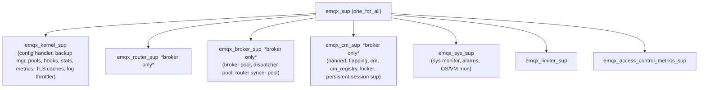
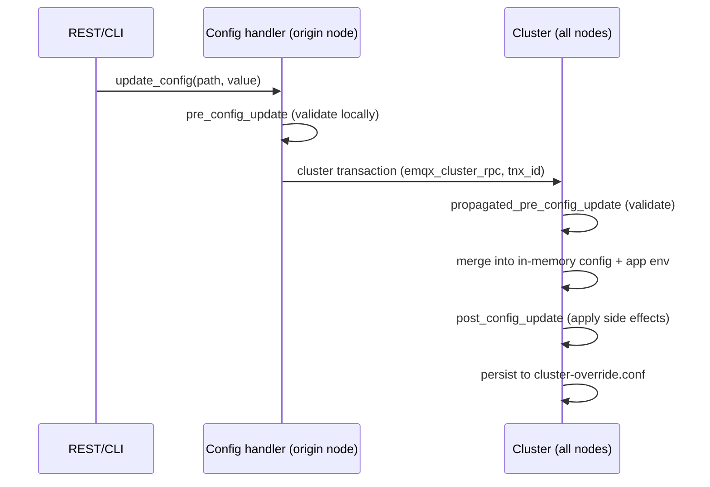

# 06 — Clustering & Configuration

This document covers two intertwined concerns: how a node **boots and forms a cluster** (so that
routing, the client registry, and config are shared), and how the system is **configured** (HOCON
schema, validation, cluster-wide hot-update). Configuration is **MVP**; clustering is **Phase 3**
— but the seams that make clustering possible should be respected from the start.

## 1. Boot & supervision tree

**Key source.** `apps/emqx_machine/src/emqx_machine.erl` is the boot coordinator: it sets up the
Erlang distribution transport, initializes Ekka/Mria (cluster + replication), validates feature
flags, and starts applications. `apps/emqx/src/emqx_app.erl` is the broker application's start
callback (creates tables, loads config, registers config handlers, starts listeners).

The root supervision tree (verified in `apps/emqx/src/emqx_sup.erl`, strategy `one_for_all`):

The `*broker only*` children are started only when broker mode is enabled
(`emqx_boot:is_enabled(broker)`) — a node can run in a limited mode (e.g. tooling) without them.
`emqx_kernel_sup` starts the **config handler first** because everything else reads configuration.

**Portable notes.** Map this to a deterministic **startup sequence**: (1) load & validate config,
(2) bring up shared in-memory tables and the hook registry, (3) join the cluster / open replicated
stores, (4) start broker services (broker, router, connection manager), (5) start listeners last
(so you don't accept traffic before you're ready). On shutdown, reverse it (stop listeners, drain,
then services). Use structured concurrency or a small supervisor for in-process workers and an
orchestrator (k8s/systemd) for the node itself — you do **not** need to reproduce OTP restart
strategies faithfully.

## 2. Clustering: core/replicant, replicated state, RPC

**Responsibility.** Form a cluster, replicate the tables that must be cluster-wide (routes, client
registry, config, ACL data), and provide inter-node calls (forward a publish, run a takeover,
aggregate stats).

**Key source.**
- `apps/emqx/src/emqx_cluster.erl` — high-level join/leave/force-leave (wraps the `ekka` cluster
  library). Membership discovery strategies (static list, DNS, etcd, k8s) are config-driven.
- **Mria** (built on Mnesia) provides the **core/replicant** replicated tables (see
  [01 §4](./01-overview-and-concepts.md)): cores hold authoritative copies and accept writes;
  replicants keep read-only local copies via a replication log and forward writes to a core. Tables
  are organized into **shards** (e.g. routing shard, connection-manager shard, config-RPC shard).
- `apps/emqx/src/emqx_rpc.erl` — inter-node RPC over `gen_rpc` (async/sync/multicall), abstracting
  transport and error handling (`badrpc`/`badtcp`).
- `apps/emqx_bpapi/` — **Backplane API versioning.** Each app declares which RPC API versions it
  supports; nodes announce their versions and only call APIs the whole cluster supports. This is
  what enables **rolling upgrades** across mixed versions. **(Optional in a reimplementation —
  only needed if you require zero-downtime mixed-version upgrades.)**
- `apps/emqx_conf/src/emqx_cluster_rpc.erl` — a distributed **config transaction** coordinator: a
  change is assigned a transaction id (`tnx_id`), committed via Mria, and applied on every node;
  lag and catch-up are tracked so a node that was offline replays missed changes.
- `apps/emqx_cluster_link/` — links **separate clusters** (e.g. across regions) by exchanging
  route/topic updates through an external-broker bridge. **Optional.**

What is actually replicated cluster-wide:
| Table | Purpose | Doc |
|-------|---------|-----|
| Routes | which nodes want which topics/filters | [02](./02-broker-core.md) |
| Client registry | which node owns which client id | [03](./03-sessions-and-clients.md) |
| Config / ACL / users | cluster-consistent settings & policies | this doc, [04](./04-access-control.md) |
| Shared-sub membership, banned list, alarms | misc cluster state | [02](./02-broker-core.md), [04](./04-access-control.md) |

**Portable notes.** You do not need Mnesia/Mria. Pick a replication strategy per table by its
consistency needs:
- **Routes & registry** tolerate brief inconsistency (a missed delivery is recovered by QoS
  retransmit) → eventually-consistent replication / gossip / a replicated KV is fine.
- **Config, ACL, users** want linearizable updates → a **Raft-backed KV** (etcd/embedded Raft) or
  SQL with a transaction + change feed.
Replace distributed Erlang with a **gRPC/HTTP2 mesh** plus service discovery; replace `gen_rpc`
multicall with fan-out RPC. Keep the **single seam** "forward this publish to nodes N" and "find
the node owning client C" clean and clustering remains an additive phase. Skip BPAPI unless you
need rolling mixed-version upgrades; otherwise require a full-cluster restart for upgrades.

## 3. Configuration system

**Responsibility.** Parse a hierarchical config, validate it against a typed schema, expose it
cheaply at runtime, **hot-update** it without restart, and propagate updates cluster-wide.

**Key source.**
- **HOCON** is the config format (a JSON superset with includes, substitutions, units like `10s`,
  `64MB`). The schema is defined with `hoconsc`/`typerefl` in `apps/emqx/src/emqx_schema.erl`
  (core: node, cluster, listeners, mqtt, limiters, …) and assembled across all apps by
  `apps/emqx_conf/src/emqx_conf_schema.erl`. Custom converters/validators handle durations, byte
  sizes, IP:port, URLs, TLS options, etc.
- `apps/emqx/src/emqx_config.erl` — holds the effective config (an in-memory map plus values
  pushed into application environments), with `get/1,2`, `put/2`, `fill_defaults`, and
  `save_configs`.
- `apps/emqx/src/emqx_config_handler.erl` — a `gen_server` that runs **config updates** through a
  chain of callbacks registered by each subsystem:
  - `pre_config_update/3` — validate a proposed change (may reject),
  - `post_config_update/5` — apply side effects (restart a listener, reload an auth backend),
  - `propagated_pre/post_config_update` — the same on every node when a change is broadcast.
- `apps/emqx/src/emqx_zone_schema.erl` — **zones**: named overrides of MQTT/runtime settings that a
  listener can opt into, so different listeners can have different limits/behaviour without
  duplicating the whole config.
- `apps/emqx/src/emqx_config_backup_manager.erl` — periodic config snapshots and
  `cluster-override.conf` persistence for recovery.

**Update flow (hot, cluster-wide):**

Config precedence (lowest → highest): schema defaults → `emqx.conf` (+ includes) → environment
overrides → `cluster-override.conf` (runtime API/CLI changes).

**Portable notes.**
- Use **YAML/TOML** instead of HOCON and a schema/validation library (or a typed config struct with
  validators). Keep the layering: defaults < file < env < runtime overrides.
- Reproduce the **validate-then-apply, with side-effect hooks** pattern: a change is validated
  before it is accepted, and subsystems register "what to do when *my* config changes" (reload,
  restart listener, rebuild auth chain). Expose effective config via a read-mostly snapshot
  (atomic pointer swap) so the hot path reads it without locks.
- Cluster-wide propagation reuses your config store + RPC mesh from §2. For single-node, "hot
  update" is just: validate → swap the snapshot → notify subscribers.

---

**Next:** persisting messages and sessions →
[07 — Durable Storage](./07-durable-storage.md).
