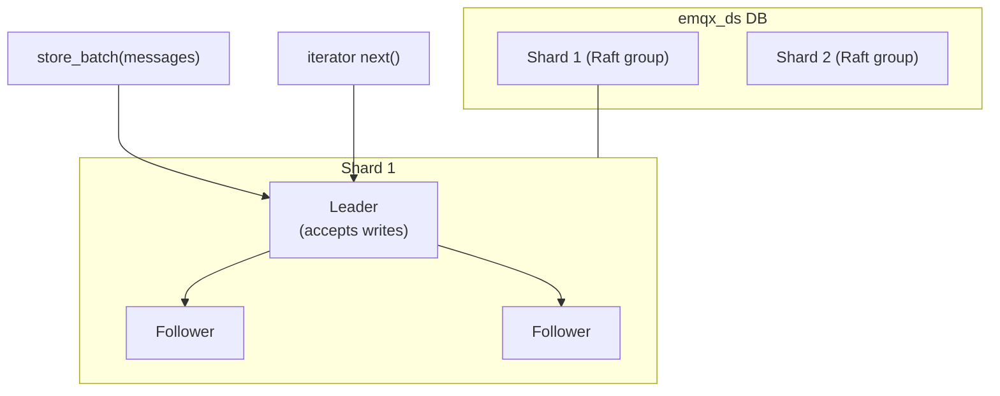

# 07 — Durable Storage (`emqx_ds`), Durable Sessions & Message Queue

Durable storage is what lets EMQX **persist MQTT messages and session state** so they survive node
restarts and can be replicated for fault tolerance. It is the foundation for durable sessions and
the message-queue feature. This is the **heaviest optional subsystem** — an MVP broker is entirely
in-memory. Treat all of it as **Phase 3**.

> If you remember one thing: the durable layer is an **append-only, time-ordered message log you
> replay by iterator**, optionally replicated by Raft. You can implement a minimal version with an
> embedded log/KV and add replication later — or skip it entirely and only ever offer in-memory
> sessions.

## 1. The `emqx_ds` abstraction

**Responsibility.** Provide a backend-agnostic API for storing streams of messages and reading
them back efficiently, with pluggable single-node or replicated implementations.

**Key source.** `apps/emqx_durable_storage/src/emqx_ds.erl` is the façade. Core operations:
```
open_db(DB, Config) / close_db(DB)
store_batch / dirty_append(DB, [Message])     %% write messages
get_streams(DB, TopicFilter, StartTime)        %% find streams matching a filter
make_iterator(DB, Stream, TopicFilter, StartTime)
next(DB, Iterator, BatchSize)                  %% pull the next batch + advanced iterator
subscribe(DB, ...)                             %% push-style durable subscription
```

**Concept hierarchy** (the storage data model):
| Concept | Meaning |
|---------|---------|
| **DB** | A logical database for a class of data (e.g. messages, session metadata). |
| **Shard** | A partition of a DB (by client/topic key); the unit of replication. |
| **Generation** | A time/size epoch within a shard; old generations are dropped to enforce TTL/retention. |
| **Slab** | A physical storage segment within a generation. |
| **Stream** | A time-ordered sequence of messages matching a topic filter within a shard. |
| **Iterator** | A resumable cursor over a stream; supports replay and fast-forward. |

Supporting modules: `emqx_ds_storage_layer.erl` (low-level segment I/O, RocksDB-style),
`emqx_ds_beamformer.erl` (batches writes into efficient stored form), `emqx_ds_client.erl`
(iterator/subscription client API), and `emqx_ds_optimistic_tx.erl` (MVCC-style optimistic
transactions for consistent multi-message writes).

## 2. Backends: local vs raft

**Key source.** Selected via `apps/emqx_ds_backends/`:
- `apps/emqx_ds_builtin_local/` — **single-node** embedded backend (no replication). Lowest
  complexity; data is durable on that node only.
- `apps/emqx_ds_builtin_raft/` — **replicated** backend. Each shard is a **Raft group**
  (`*_shard` = membership/leader election, `*_machine` = the replicated state machine applying
  committed log entries, plus snapshots for log compaction). Writes go to the shard leader and
  replicate to followers, giving strong durability and automatic failover.



**Portable notes.** Define a `DurableStore` interface mirroring `emqx_ds` (append, list streams by
filter+time, make iterator, next). For a minimal durable build, back it with an **embedded
append-only log or LSM KV** (RocksDB/LMDB/SQLite/your-language equivalent), keyed so you can scan
by topic + time. Add replication only when you need HA — and prefer an **off-the-shelf Raft
library** or a managed replicated store over hand-rolling consensus. Generations map naturally to
time-bucketed segments you can delete wholesale for TTL.

## 3. Durable sessions

**Key source.** `apps/emqx/src/emqx_persistent_session_ds.erl` (+ `emqx_persistent_session_ds/`,
metadata in `include/emqx_durable_session_metadata.hrl`). This is the `emqx_session` behaviour
([03](./03-sessions-and-clients.md)) implemented on top of `emqx_ds`: subscriptions and the
session's position in each matching message stream are persisted, so after a restart (or a
takeover on another node) the session resumes and **replays** undelivered messages by re-reading
streams from its last acknowledged position. QoS-2 exactly-once is preserved using sequence
numbers in the durable metadata.

The key design difference from in-memory sessions: instead of holding a private copy of every
queued message, a durable session holds **iterators/positions into shared durable message
streams**, plus the acknowledgement state. This is far more memory-efficient for large fan-out and
is what enables a session to move between nodes.

**Portable notes.** Model a durable session as: persisted `{subscriptions, per-stream cursor,
ack/inflight state}`. Delivery = advance the cursor over the durable streams that match the
subscriptions; acks persist the cursor. This decouples session memory from queue depth and lets
sessions migrate — but it requires the durable store (§1–2) first. Most reimplementations should
ship **in-memory sessions only** and add this much later, if ever.

## 4. Message Queue & durable timers

- **Message Queue** — `apps/emqx_mq/`. Adds queue semantics on top of `emqx_ds`: durable storage
  of messages per queue, configurable lifecycle (TTL, size limits), load-balanced consumption, and
  optional last-value retention. It is how EMQX offers "messages preserved until consumed" beyond
  basic MQTT sessions. **Optional.**
- **Durable timers** — `apps/emqx/src/emqx_durable_will.erl` and `apps/emqx_durable_timer/`:
  timers (e.g. will-message delay, message expiry) that survive restarts by persisting their
  deadline. **Optional** — in-memory timers suffice unless you need delays to outlive a crash.

**Portable notes.** Both are thin layers over the durable store and the scheduler. Skip for MVP
and Phase 2. If you later need durable delays, persist `(deadline, action)` records and have a
sweeper fire due entries on startup and on tick.

---

**Next:** operating and observing the platform →
[08 — Management & Observability](./08-management-and-observability.md).
