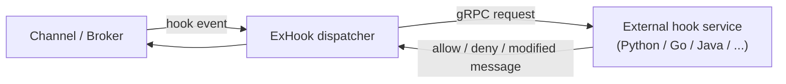

# 09 — Extensibility & Gateways

Two ways EMQX is extended beyond its built-in MQTT behaviour: **plugins / external hooks** (run
your own logic at lifecycle points) and **gateways** (speak non-MQTT protocols and map them onto
the broker). For a reimplementation, the **gRPC ExHook** model is the standout idea to copy;
native plugins and most gateways are **Optional**.

## 1. In-process plugins

**Responsibility.** Load third-party code that registers hook callbacks ([02 §8](./02-broker-core.md))
and config schema, without rebuilding the broker.

**Key source.** `apps/emqx_plugins/` (`emqx_plugins.erl` lifecycle:
`ensure_installed/enabled/disabled`, `list`, `update_config`; `emqx_plugins_apps.erl`,
`emqx_plugins_fs.erl`). A plugin is packaged as an Erlang/OTP application tarball, unpacked into
`data/plugins/<name>-<vsn>/`, started/stopped at runtime, and its config merged into the global
config and persisted in `cluster-override.conf`.

**Portable notes.** Native in-process plugins are language- and runtime-specific (in EMQX they
exploit BEAM's hot-loading). In another technology, prefer one of:
- **gRPC/out-of-process plugins** (see §2) — language-agnostic, isolated, the safest choice.
- **WASM modules** — sandboxed, portable, good for message transforms / filters.
- **Compile-time registration** — link plugins at build time and enable via config (simplest if
  you control all plugins).
Only build dynamic in-process loading if your runtime supports it cleanly. For most reimplementations,
**skip native plugins** and offer ExHook + the rule engine as the extension surface.

## 2. ExHook — external hooks over gRPC ⭐

**Responsibility.** Let an **external service in any language** intercept the same hook points the
in-process pipeline exposes (connect, authenticate, authorize, publish, deliver, …) over gRPC, and
return decisions (allow/deny/modify) or just observe.

**Key source.** `apps/emqx_exhook/` (`emqx_exhook.erl` dispatcher with `call_fold/3`,
`emqx_exhook_mgr.erl` server pool, `emqx_exhook_server.erl` per-endpoint connection). EMQX calls
the remote gRPC service for each subscribed hook; the response can short-circuit the chain (e.g.
deny a publish) or rewrite the message.

**Portable notes.** This is the **recommended primary extension mechanism for a polyglot rebuild**:
define the same hook points as a gRPC (or HTTP) contract, let operators register external handlers,
and fold their responses into the in-process hook pipeline. It cleanly decouples extensions from
the broker's language and process. A strong Phase-2 target once hooks exist.

## 3. Gateways — non-MQTT protocols

**Responsibility.** Terminate other IoT protocols and translate their primitives
(connect / publish / subscribe / disconnect) into the broker's internal abstractions, so a CoAP or
LwM2M device can interoperate with MQTT clients through the same pub/sub core, auth, and routing.

**Key source.** `apps/emqx_gateway/` is the framework: `emqx_gateway.erl` (load/start/stop/update a
gateway), `emqx_gateway_cm.erl` (a connection manager parallel to `emqx_cm` for non-MQTT clients).
Each protocol is a separate app:

| Gateway app | Protocol |
|-------------|----------|
| `emqx_gateway_coap` | CoAP (RFC 7252) |
| `emqx_gateway_lwm2m` | OMA LwM2M |
| `emqx_gateway_mqttsn` | MQTT-SN (sensor networks, UDP) |
| `emqx_gateway_stomp` | STOMP |
| `emqx_gateway_exproto` | **Extensible**: define a custom protocol's adapter as a gRPC service |
| `emqx_gateway_nats` | NATS |
| `emqx_gateway_ocpp` | OCPP (EV charging) |
| `emqx_gateway_gbt32960`, `emqx_gateway_jt808` | Vehicle telematics protocols |

A gateway reuses the broker's core: it authenticates via the same AuthN backends, registers clients
in its own connection manager, and publishes/subscribes through the same broker/router. `exproto`
is notable — it lets you implement a protocol adapter **out-of-process over gRPC**, mirroring the
ExHook philosophy.

**Portable notes.** Gateways are clearly **optional** — only add a protocol you actually need.
The reusable design idea is the **adapter contract**: each protocol adapter only needs to map its
messages to four broker operations — *authenticate, publish, subscribe/unsubscribe, deliver* — plus
a connection-lifecycle. Keep that internal API small and any new protocol is a self-contained
adapter (ideally an `exproto`-style external process). For an MQTT-focused reimplementation, ship
MQTT only and treat gateways as a much later, à-la-carte phase.

---

**Next:** putting it together into a buildable plan →
[10 — Reimplementation Roadmap](./10-reimplementation-roadmap.md).
