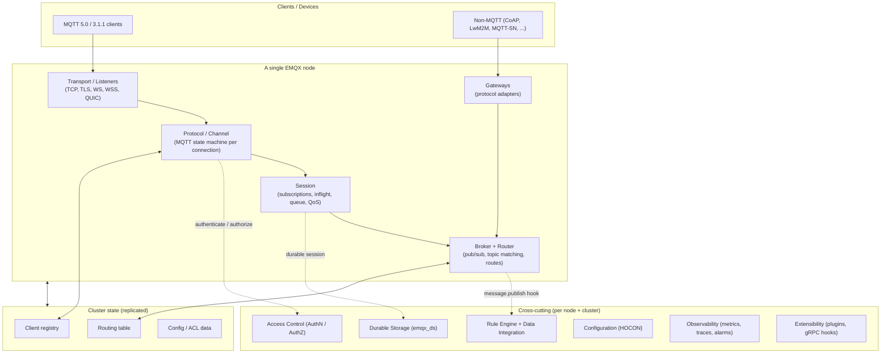

# EMQX Architecture — A Reference for a Smaller Reimplementation

This folder is a **technology-agnostic architecture design document** for the EMQX MQTT
platform. It has two jobs:

1. **Map the complete platform** — every major subsystem of EMQX, grounded in the actual
   source, so that nothing important is missed.
2. **Enable a smaller reimplementation in a different technology** — every Erlang/OTP/BEAM
   mechanism is paired with a portable "what concept replaces this" note, and every subsystem
   is tagged **MVP**, **Phase 2**, or **Optional** so you can build a focused subset.

EMQX itself is an Erlang/OTP umbrella project of ~127 applications under `apps/`. You do **not**
need to reproduce all of it. The [reimplementation roadmap](./10-reimplementation-roadmap.md)
describes a minimal viable broker and how to grow it.

> Scope note: this document describes the architecture and data model. It cites source paths
> (e.g. `apps/emqx/src/emqx_broker.erl`) as the authoritative reference — read those when you
> need exact field-by-field behaviour. It is written so a reader who has never used Erlang can
> follow it.

## How to read this

| # | Document | What it covers |
|---|----------|----------------|
| — | [README.md](./README.md) (this file) | Index, application catalog, MVP/phase map |
| 01 | [Overview & Concepts](./01-overview-and-concepts.md) | MQTT primer, layered architecture, domain model, **the BEAM→portable mapping table** |
| 02 | [Broker Core](./02-broker-core.md) | Listeners, protocol/channel, pub/sub routing, topic matching, hooks |
| 03 | [Sessions & Clients](./03-sessions-and-clients.md) | Sessions, inflight/queue/QoS, connection manager, takeover |
| 04 | [Access Control](./04-access-control.md) | Authentication chain, authorization sources, ACL, caching |
| 05 | [Rule Engine & Data Integration](./05-rule-engine-and-integration.md) | SQL rule engine, resource/connector/bridge layer, transforms |
| 06 | [Clustering & Configuration](./06-clustering-and-configuration.md) | Boot, core/replicant cluster, RPC, HOCON config, hot-update |
| 07 | [Durable Storage](./07-durable-storage.md) | `emqx_ds` abstraction, local vs raft backends, durable sessions, MQ |
| 08 | [Management & Observability](./08-management-and-observability.md) | HTTP API, dashboard, CLI, metrics, Prometheus/OTel, tracing, audit |
| 09 | [Extensibility & Gateways](./09-extensibility-and-gateways.md) | Plugins, gRPC hooks (ExHook), multi-protocol gateways |
| 10 | [Reimplementation Roadmap](./10-reimplementation-roadmap.md) | MVP scope, what to drop, phased plan, conformance testing |

Recommended order for a reimplementer: **01 → 02 → 03 → 04 → 10**, then dip into 05–09 as the
project grows.

## The layered architecture at a glance

## Application catalog (the complete platform)

Every directory under `apps/` grouped by responsibility, each tagged with where it lands in a
reimplementation. **MVP** = build first; **P2** = phase two; **Opt** = optional / specialized.

### Core broker — **MVP**
| App | Role |
|-----|------|
| `emqx` | The broker itself: listeners, protocol/channel, sessions, broker/router, topic index, hooks, config plumbing, metrics, limiter. The heart of the system. |
| `emqx_utils` | Shared utilities incl. the `#message{}` record (`include/emqx_message.hrl`), templates, JSON. |
| `emqx_ctl` | CLI command framework (register/dispatch admin commands). |

### Configuration & node/cluster infrastructure — **MVP (config)** / **P2 (cluster)**
| App | Role |
|-----|------|
| `emqx_conf` | HOCON umbrella schema, cluster config transactions, CLI. |
| `emqx_machine` | Boot coordinator, Ekka/Mria setup, distributed transport. |
| `emqx_bpapi` | Backplane API **version negotiation** between nodes (Opt). |
| `emqx_cluster_link` | Cross-cluster bridging (Opt). |
| `emqx_mt` | Multi-tenancy namespaces (Opt). |
| `emqx_node_rebalance`, `emqx_eviction_agent` | Connection rebalancing/draining for ops (Opt). |

### Access control — **MVP (basic)** / **P2 (external backends)**
| App | Role |
|-----|------|
| `emqx_auth` | AuthN chain + AuthZ source framework, built-in file/HTTP sources, the provider/source behaviours. |
| `emqx_auth_mnesia` | Built-in user/ACL database (MVP-friendly). |
| `emqx_auth_http`, `_jwt`, `_redis`, `_mysql`, `_postgresql`, `_mongodb`, `_ldap`, `_kerberos`, `_cinfo` | Pluggable AuthN/AuthZ backends (P2/Opt). |

### Messaging features — **MVP (retained)** / **P2–Opt (rest)**
| App | Role |
|-----|------|
| `emqx_retainer` | Retained-message store + delivery on subscribe (MVP). |
| `emqx_mq` | Durable **Message Queue** semantics on top of `emqx_ds` (Opt). |
| `emqx_streams` | Stream/“last value” messaging (Opt). |
| `emqx_auto_subscribe` | Auto-subscribe clients to configured topics (Opt). |
| `emqx_topic_metrics`, `emqx_slow_subs` | Per-topic metrics, slow-subscriber detection (Opt). |
| `emqx_psk`, `emqx_setopts` | TLS-PSK lookup, socket option tuning (Opt). |

### Rule engine & data integration — **P2**
| App | Role |
|-----|------|
| `emqx_rule_engine` | SQL rule engine: parser, runtime, events, built-in functions/actions. |
| `emqx_resource` | Generic external-resource abstraction: lifecycle, health, buffering, batching, pooling. |
| `emqx_connector`, `emqx_connector_aggregator`, `emqx_connector_jwt` | Connection configs and batch/upload aggregation. |
| `emqx_bridge`, `emqx_gen_bridge`, `emqx_bridge_*` (50+) | Actions/sources to external systems (Kafka, HTTP, MQTT, SQL DBs, S3, …). Implement a few, not all. |
| `emqx_message_transformation` | Edit messages in-flight before rules see them (Opt). |
| `emqx_schema_registry`, `emqx_schema_validation` | Protobuf/Avro/JSON-Schema registry + validation (Opt). |
| `emqx_mysql`, `emqx_postgresql`, `emqx_redis`, `emqx_mongodb`, `emqx_oracle`, `emqx_ldap`, `emqx_s3` | Shared DB/storage client libraries used by bridges/auth. |

### Durable storage — **Phase 3 / Opt**
| App | Role |
|-----|------|
| `emqx_durable_storage` | `emqx_ds` facade: streams, iterators, generations, optimistic transactions. |
| `emqx_ds_builtin_local` | Single-node embedded backend. |
| `emqx_ds_builtin_raft` | Raft-replicated backend (strong durability). |
| `emqx_ds_backends` | Backend registry/selection. |
| `emqx_durable_timer` | Durable timers (e.g. delayed will). |

### Management & observability — **MVP (minimal API)** / **P2 (dashboard/full)**
| App | Role |
|-----|------|
| `emqx_management` | REST API (`/api/v5/...`) over Cowboy + Minirest, cluster query/pagination. |
| `emqx_dashboard`, `emqx_dashboard_rbac`, `emqx_dashboard_sso` | Dashboard HTTP server, OpenAPI/Swagger, API auth (JWT), RBAC/SSO. |
| `emqx_prometheus`, `emqx_opentelemetry`, `emqx_telemetry` | Metrics/trace export (standards — keep these). |
| `emqx_audit` | Audit log of admin actions. |
| `emqx_modules` | Misc built-in modules (delayed publish, rewrite, telemetry toggles). |
| `emqx_license` | Commercial license enforcement (drop in a reimplementation). |

### Extensibility & gateways — **Opt** (ExHook is a strong **P2** pick)
| App | Role |
|-----|------|
| `emqx_plugins` | Load/enable/disable plugin packages (Erlang-app tarballs). |
| `emqx_exhook` | **gRPC hook services** — language-agnostic extension model; recommended for a polyglot rebuild. |
| `emqx_extsub` | External subscription integration. |
| `emqx_gateway` + `emqx_gateway_cm` | Gateway framework (non-MQTT protocols → broker abstractions). |
| `emqx_gateway_{coap,lwm2m,mqttsn,stomp,exproto,nats,ocpp,gbt32960,jt808}` | Individual protocol adapters. |

### Specialized / enterprise — **Opt (mostly drop)**
| App | Role |
|-----|------|
| `emqx_ft` | MQTT file transfer. |
| `emqx_ai_completion`, `emqx_a2a_registry` | AI processing / agent registry. |
| `emqx_gcp_device` | GCP IoT device compatibility. |
| `emqx_mix_utils` | Build-system helper (not runtime). |

## The one-paragraph summary

An EMQX node accepts client connections on **listeners**, runs an MQTT **protocol state
machine** (channel) per connection, attaches a **session** that tracks subscriptions and
QoS-1/2 delivery state, and routes published messages through a **broker + router** that match
topics (including wildcards) to local and remote subscribers. **Access control** gates connect
/ publish / subscribe. A **rule engine** can intercept messages via **hooks**, transform them
with SQL, and forward them to external systems through a generic **resource/connector** layer.
A **cluster** of nodes replicates the routing table, client registry, and config using
Mnesia/Mria + distributed Erlang; **durable storage** optionally persists sessions and messages
via a Raft log. Everything is configured with **HOCON**, observable via **metrics/traces**, and
extensible via **plugins/gRPC hooks** and protocol **gateways**. For a smaller build, keep the
bold path (listeners → channel → session → broker/router → basic auth) and add the rest in
phases.
